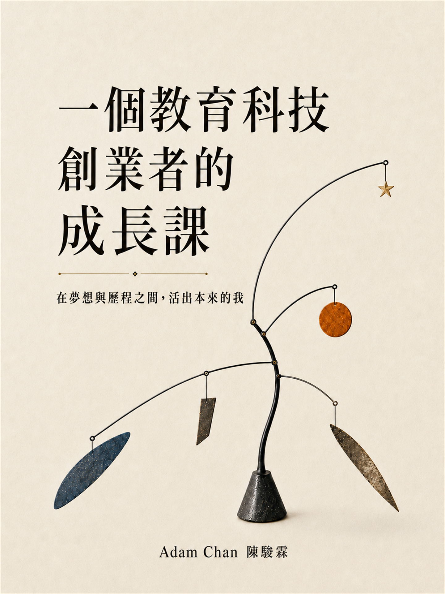
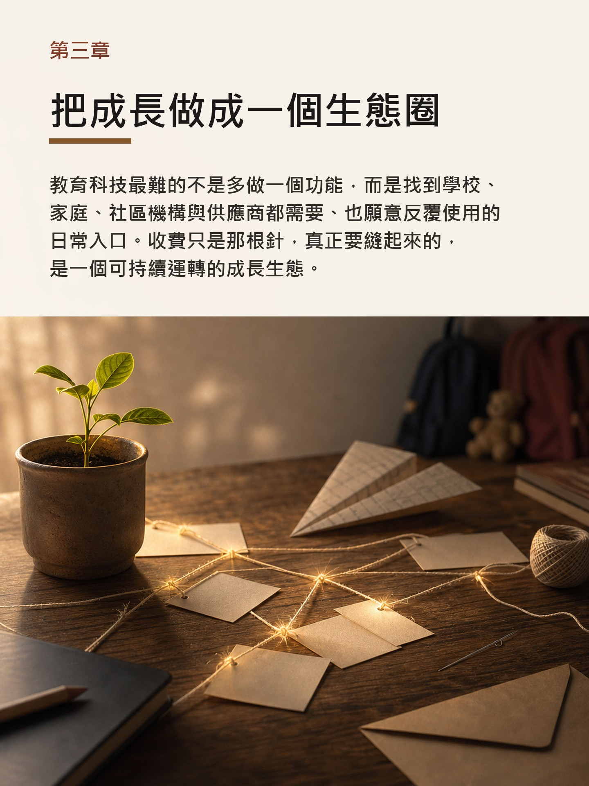

# 一個教育科技創業者的成長課

這是 Adam Chan 陳駿霖的創業回憶錄《一個教育科技創業者的成長課》公開下載頁，提供 HTML 閱讀頁、EPUB 與 PDF。

副題：在夢想與歷程之間，活出本來的我。

## 公開入口

- HTML 閱讀與下載頁：<https://adamchanadam.github.io/adam-startup-memoir/>
- GitHub repository：[Adamchanadam/adam-startup-memoir](https://github.com/Adamchanadam/adam-startup-memoir)
- EPUB 下載：<https://adamchanadam.github.io/adam-startup-memoir/downloads/adam_chan_startup_memoir.epub>
- PDF 下載：<https://adamchanadam.github.io/adam-startup-memoir/downloads/adam_chan_startup_memoir.pdf>

## 這是甚麼

《一個教育科技創業者的成長課》記錄一段教育科技創業路：由相信孩子的成長應被看見，到建立平台、承擔壓力、經歷身體警號、放手，最後重新活出自己。

這不是公司年表，也不是成功學手冊，而是一段關於相信、建造、承擔、壓力、放手與重新開始的生命記錄。

## Adam Chan 是誰

Adam Chan 陳駿霖是香港教育科技界的資深從業者。1998 年由互聯網與網頁設計起步；2001 年出版繁體中文 Flash 教學書《Flash 動之物世界》；2002 至 2003 年間參與教育署課程發展相關的資訊科技工作，開始把設計能力放進教育場景。

2003 至 2015 年，他在服務港澳學校市場的教育平台公司深耕十二年，由設計總監兼電子校園方案顧問，做到總經理。期間參與過學校行政、學生檔案、家校平台、電子圖書館、電子書包、電子學習與校本化系統等項目；當中的 Library Master OPAC 2.0 於 2011 年獲香港資訊及通訊科技獎銅獎。

2015 年，他開始建立 GRWTH，嘗試把學校、家庭、學生、社區機構與服務供應商接成一個成長生態。當中的 GRWTH Pay 於 2019 年獲香港資訊及通訊科技獎智慧生活獎金獎，GRWTH VOD 雲課堂系統於 2020 年獲香港電腦學會 Outstanding Education Award。這本回憶錄把上述經歷放回第一人稱的回望裡，記下一個人在教育科技創業路上，如何由相信一個方向，到建立產品與團隊，承擔壓力，學習放手，最後在新的生活節奏中重新整理自己。

## 書封與內頁預覽

不一定每位讀者都會即時下載 EPUB 或 PDF，所以這裡先放出書封與章節開場頁，讓讀者先看見這本書的語氣、節奏與內容方向。

| 序章 | 第三章 | 第七章 |
|---|---|---|
|  |  |  |

## 適合誰讀

- 曾與 Adam 一起工作、建造、推動項目的人。
- 教育界朋友、學校工作者、家校合作同行。
- 香港初創圈朋友。
- 仍在承擔、相信、懷疑與重新排序人生的人。

## 閱讀與下載

- HTML 閱讀頁：<https://adamchanadam.github.io/adam-startup-memoir/>
- EPUB：`downloads/adam_chan_startup_memoir.epub`
- PDF：`downloads/adam_chan_startup_memoir.pdf`

EPUB 適合 Kobo、Apple Books 或手機閱讀器；PDF 保留固定版面，適合收藏、列印或轉發。

## 章節路線

1. 序章：放手，是為了把自己重新活出來
2. 第一章：創業前的我：為何離開安穩
3. 第二章：讓孩子的成長被看見
4. 第三章：把成長做成一個生態圈
5. 第四章：逆風裡一步一步往前推
6. 第五章：停課了，成長不能停
7. 第六章：成功之後，壓力才真正開始
8. 第七章：身體比我更早知道答案
9. 第八章：離開之後，留下的是能力
10. 結語：真正的成長，是傷口再碰也不痛

## 檔案核查

本地 staging package 已完成以下檢查：

- EPUBCheck：0 error / 0 warning
- PDF：70 頁、19 個書籤
- PDF 文字：書名與致謝可搜尋
- PDF 內容檢查：未搜到 `craft note`
- HTML：本地引用缺失數為 0

詳細檔案大小、雜湊與未完成事項見 `RELEASE_MANIFEST.md`。

## 搜尋與分享

本頁已加入：

- HTML title 與 meta description
- Open Graph 與 Twitter Card metadata
- Schema.org JSON-LD：`WebPage`、`Book`、`FAQPage`
- `robots.txt`
- `sitemap.xml`
- `llms.txt`
- GitHub / social preview image：`assets/social-preview.png`

正式公開網址：

`https://adamchanadam.github.io/adam-startup-memoir/`

公開 repository：

`https://github.com/Adamchanadam/adam-startup-memoir`

## 作者

Adam Chan 陳駿霖

## 授權與使用

© Adam Chan. 本下載包內的回憶錄文字、公開下載頁、封面、預覽圖片、EPUB、PDF，以及相關面向讀者的材料，由 Adam Chan 保留著作權，並以 Creative Commons Attribution-NonCommercial-NoDerivatives 4.0 International（CC BY-NC-ND 4.0）授權公眾非商業原樣分享。

你可以分享原始連結或原始檔案，但必須標示作者，不可商業使用，不可改作、翻譯、重混、剪輯成衍生作品，亦不可暗示 Adam Chan 認可你的使用。

授權全文見 `LICENSE.md`，官方授權頁：<https://creativecommons.org/licenses/by-nc-nd/4.0/>。
